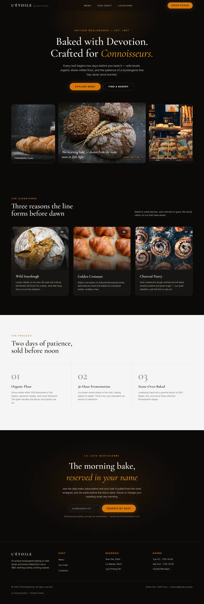
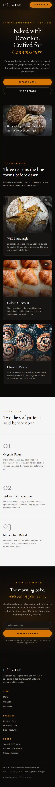

# L'Étoile Bakeshop

> **Concept project.** L'Étoile Bakeshop is a fictional brand created to
> demonstrate design execution, technical SEO, performance, and accessibility.
> It is not a real business and was not built for a client. The name, copy,
> Paris address, and email address are all invented. The engineering is real.

A single-page site for an artisan boulangerie, built to show what a fast,
search-friendly web presence looks like for a small or local business. The
design leans on warm obsidian, a cream plate, and a gold accent, with Cormorant
Garamond set large for the headlines and Inter carrying the body — the intent
being a bakery that reads as expensive and unhurried rather than cheerful and
busy. The whole page is prerendered to static HTML, images and fonts are
optimized at the framework level, and there is no component library, animation
library, or state manager anywhere in it.

**Live site:** https://letoile-bakeshop.vercel.app

## Screenshots

| Desktop | Mobile |
| --- | --- |
|  |  |

## Lighthouse

Measured with Lighthouse 12 against the deployed site above, not a local build.
Mobile uses Lighthouse's default simulated 4G throttling, which is the harsher
and more realistic of the two.

| | Performance | Accessibility | Best Practices | SEO |
| --- | --- | --- | --- | --- |
| **Mobile** | 93 | 100 | 100 | 100 |
| **Desktop** | 100 | 100 | 100 | 100 |

Core Web Vitals — mobile: FCP 1.1s, LCP 3.1s, TBT 100ms, CLS 0, Speed Index
2.9s. Desktop: FCP 0.3s, LCP 0.7s, TBT 0ms, CLS 0.

Mobile LCP is the honest weak spot. Under simulated 4G the largest element
repaints when the serif webfont swaps in. Everything under my control — image
weight, `sizes` accuracy, `priority` placement, font payload — has been tuned;
closing the rest would mean changing the typeface or dropping the webfont,
which is a brand decision rather than a technical one.

## What this demonstrates

- **Technical SEO** — full `Metadata` export with `metadataBase`, canonical
  URL, Open Graph and Twitter card tags; `/sitemap.xml` and `/robots.txt` via
  the App Router's file conventions; a build-time generated social image.
- **Structured data** — `Bakery` (schema.org `LocalBusiness`) JSON-LD with
  address, opening hours, and price range, so a search engine can surface hours
  and location directly. The hours in the schema and the hours in the footer
  are derived from one shared constant and cannot drift apart.
- **Responsive layout** — one column on mobile, three-up on desktop, with the
  hero's flanking frames dropped entirely below `lg` rather than squeezed.
- **Image optimization** — every photograph is served from `public/images` as
  WebP, cropped to the largest size its slot actually renders, with `sizes`
  matching the real layout and `priority` on the hero alone. Nothing is
  hotlinked, so no third-party CDN can break the page.
- **Accessibility** — 100 on Lighthouse: a real document outline with no
  skipped heading levels, a visible focus indicator on every interactive
  element, all body text at or above 4.5:1 contrast, descriptive `alt` text,
  and a `prefers-reduced-motion` block that neutralizes every animation.

## Stack

- **Next.js 16.2.10**, App Router
- **React 19.2.4**
- **TypeScript 5**
- **Tailwind CSS 4** — configured CSS-first via `@theme`, no `tailwind.config.js`
- **next/font** — self-hosted Cormorant Garamond and Inter
- **next/image** and **next/og**
- Deployed on **Vercel**

Almost everything is a server component. Three pieces opt into the client: the
navbar, which watches scroll position to shift its background; the subscription
form, which manages its own submit state; and a one-line component that renders
the copyright year on the client so it never freezes at build time.

## A note on the subscription form

The email form is **front-end only**. It validates, shows a loading state, and
confirms — but nothing is stored and no email is ever sent or collected. Making
it real would mean a server action with server-side validation, rate limiting,
and an email provider.

## Running locally

```bash
npm install
npm run dev
```

Open http://localhost:3000.

```bash
npm run build   # production build
npm run start   # serve the production build
```

## Credits

Photography is from [Unsplash](https://unsplash.com) under the Unsplash
License. Per-image sources are recorded in
[`public/images/CREDITS.md`](public/images/CREDITS.md).
